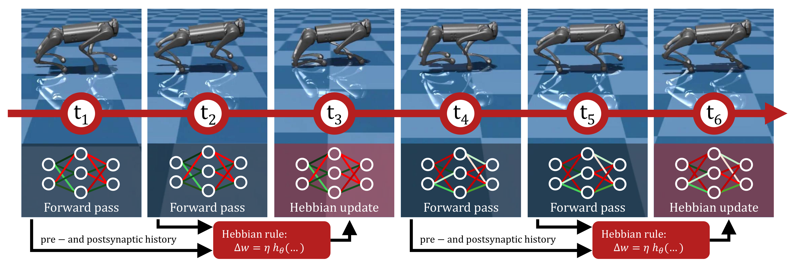
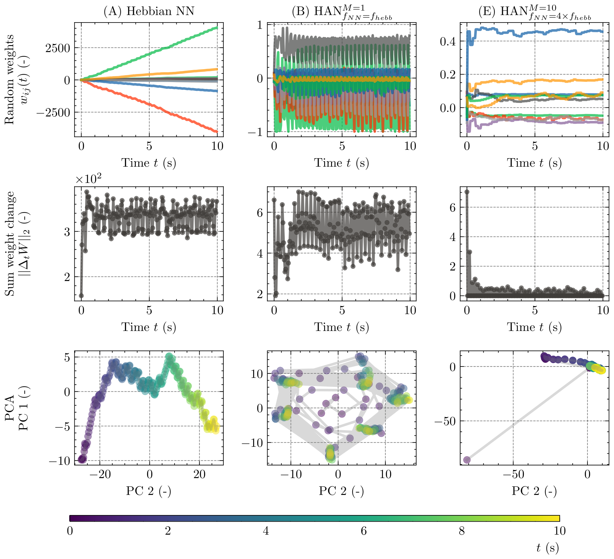
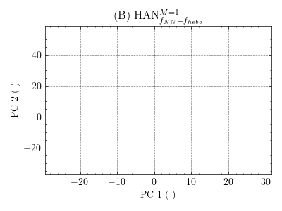
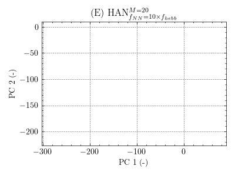

# Hebbian Attractor Networks for Robot Locomotion

<p align="center">
  <b>Alexander Dittrich, Fuda van Diggelen, and Dario Floreano</b><br>
  Laboratory of Intelligent Systems, EPFL<br>
</p>

<p align="center">
  <a href="https://arxiv.org/abs/2603.22512"></a>
  <a href="https://github.com/alexanderdittrich/hebbian-attractor-networks/blob/main/LICENSE"></a>
  <a href="https://github.com/jax-ml/jax"></a>
  <a href="https://www.python.org/"></a>
</p>

<!-- TODO: Add teaser figure or GIF showing locomotion behavior -->
<p align="center">
  
</p>

Hebbian Attractor Networks (HANs) are plastic neural networks that continuously self-modify during deployment using local Hebbian learning rules. By combining **dual-timescale plasticity** and **temporal activation averaging**, HANs give rise to distinct attractor dynamics in weight space — fixed-point attractors for stable gaits and limit-cycle attractors for co-dynamic locomotion.

<p align="center">
  
</p>

https://github.com/user-attachments/assets/03c82ee6-691d-4856-932c-c3d07f87afd4


### Attractor Dynamics
<!-- TODO: Add side-by-side GIF/video showing limit-cycle vs fixed-point weight dynamics -->
<p align="center">
  
  
  <br>
  <em>Left: Limit-cycle attractor (condition B) — weights oscillate in sync with the gait.
  Right: Fixed-point attractor (condition E) — weights converge to a stable configuration.</em>
</p>

## Key Results

- **Max normalization** transforms unbounded Hebbian updates into structured attractor dynamics
- **Slower Hebbian updates** + **activation averaging** induce fixed-point weight attractors
- **Fixed-point HANs** are robust to perturbations — the gait survives even when Hebbian updates are interrupted
- HANs outperform static MLPs and match GRUs on standard locomotion benchmarks
- Results generalize to quadrupedal locomotion on a simulated **Unitree Go1** robot
- HANs in different conditions retain adaptive behavior in Ant-task with morphologial damage as demonstrated by [Najarro](https://proceedings.neurips.cc/paper_files/paper/2020/file/ee23e7ad9b473ad072d57aaa9b2a5222-Paper.pdf), [Leung](https://doi.org/10.48550/arXiv.2503.12406).

<!-- TODO: Add video of Unitree Go1 locomotion -->
<!-- <p align="center">
  
  <br><em>Unitree Go1 quadruped trained with HANs (condition E).</em>
</p> -->

<!-- TODO: Add video/GIF of perturbation recovery (pendulum collision from Fig. 6) -->
<!-- <p align="center">
  
  <br><em>HAN recovers from a force perturbation and returns to the same weight attractor.</em>
</p> -->

## Method

HANs use a feedforward network with online Hebbian weight updates following the generalized ABCD rule:

$$\Delta w_{ij}^{(k)}(t) = \eta_{ij}^{(k)} \cdot h_{\theta_{ij}^{(k)}}\left(\bar{x}_j^{(k-1)}(t),\, \bar{x}_i^{(k)}(t)\right)$$

where activations $\bar{x}$ are computed as a moving average of length $M$. After each update, **layerwise max normalization** bounds the weights and enables attractor dynamics. Hebbian coefficients and learning rates are optimized via evolutionary strategies (ES).

| Condition | Max Norm | Window $M$ | $f_\text{NN}/f_\text{hebb}$ | Emerging Attractor |
|-----------|----------|-----------|--------------------------|----------------|
| (A) HNN | - | 1 | 1 | Unbounded |
| (B) HAN | Yes | 1 | 1 | Limit cycle |
| (C) HAN | Yes | 1 | 4 | Limit cycle / Fixed point |
| (D) HAN | Yes | 10 | 1 | Limit cycle / Fixed point |
| (E) HAN | Yes | 10 | 4 | Limit cycle / Fixed point |

## Implementation

- **Framework**: [JAX](https://github.com/jax-ml/jax) — all training and rollouts are fully vectorized
- **Optimization**: Evolutionary strategies — OpenAI-ES, CMA-ES, $(\mu, \lambda)$-ES — via [evosax](https://github.com/RobertTLange/evosax)
- **Environments**: [Gymnasium](https://github.com/Farama-Foundation/Gymnasium) (Swimmer, HalfCheetah, Hopper, Walker2d, Ant) and [MuJoCo Playground](https://github.com/google-deepmind/mujoco_playground/) (Unitree Go1, Cheetah, etc.) via MuJoCo XLA (MJX)
- **Configuration**: [Hydra](https://hydra.cc/) for composable YAML configs
- **Logging**: [Weights & Biases](https://wandb.ai/)

## Installation

```bash
git clone git@github.com:alexanderdittrich/hebbian-attractor-networks.git
cd hebbian-attractor-networks
pip install .
```

> For GPU support, install JAX with CUDA separately before `pip install .` — see [JAX installation](https://jax.readthedocs.io/en/latest/installation.html).

## Usage

Training is configured via Hydra. The main parameters controlling HAN conditions are:

| Parameter | Config key | Options |
|-----------|-----------|---------|
| Learning rule | `policy.learning_rule_cls` | `eta-abcd`, `abcd`, `eta-plain` |
| Max normalization | `policy.learning_rule_cfg.regularizer` | `abs-scale` (on), `null` (off) |
| Activation averaging | `policy.activation_buffer_cls` | `direct` (M=1), `moving-average` |
| Window size | `policy.activation_buffer_cfg.window_size` | integer (e.g., 10, 20) |
| Hebbian update interval | `update_interval` | float in seconds (`null` = same as sim) |

### Gymnasium benchmarks (HalfCheetah, Hopper, Walker2d, Swimmer)

```bash
# Condition (B): HAN with max norm, no averaging, synchronized updates
python scripts/train_gymnasium_kandel.py \
  gymnasium=HalfCheetah-v5 \
  policy=mlp-hebbian \
  strategy=openai-es

# Condition (E): HAN with max norm, moving average (M=10), decoupled updates
python scripts/train_gymnasium_kandel.py \
  gymnasium=HalfCheetah-v5 \
  policy=mlp-hebbian \
  policy.activation_buffer_cls=moving-average \
  policy.activation_buffer_cfg.window_size=10 \
  update_interval=0.2
```

### MuJoCo Playground (Cheetah, Unitree Go1)

```bash
# Cheetah locomotion
python scripts/train_playground_kandel.py \
  playground=CheetahRun \
  policy=mlp-hebbian \
  strategy=openai-es

# Unitree Go1 quadruped
python scripts/train_unitree_kandel.py \
  policy=mlp-hebbian \
  strategy=openai-es
```

### Morphological adaptation (mutilated Ant)

For the `Mutilated-Ant`-task, we use the `MuJoCo Playground` API. For PPO-training, we use `Brax` instead of `Stable-Baselines3`.
```bash
python scripts/train_ant_mutilated_kandel.py \
  policy=mlp-hebbian \
  strategy=openai-es
```

```bash
python scripts/train_ant_mutilated_ppo.py
```

### Static baselines (MLP, GRU without plasticity)

```bash
python scripts/train_gymnasium_kandel.py \
  gymnasium=HalfCheetah-v5 \
  policy=mlp \
  strategy=openai-es
```

## Repository Structure

```
config/
  gymnasium/       # Gymnasium environment configs (Ant, HalfCheetah, ...)
  playground/      # MuJoCo Playground configs (CheetahRun, Go1Walk, ...)
  policy/          # Network architectures (mlp, mlp-hebbian, gru, ...)
  strategy/        # Evolution strategies (openai-es, cma-es, ...)
scripts/           # Training entry points
src/kandel/        # Core library
  model/           # Networks, learning rules, activation buffers
  strategy/        # ES implementations
  sim_api/         # Gymnasium interface
notebooks/         # Analysis and visualization notebooks
```

## Citation

```bibtex
@INPROCEEDINGS{dittrich2026hebbian,
  title={Hebbian Attractor Networks for Robot Locomotion},
  author={Dittrich, Alexander and van Diggelen, Fuda and Floreano, Dario},
  booktitle={2026 IEEE International Conference on Robotics and Automation (ICRA)},
  year={2026},
}
```

## Acknowledgements

This work was supported by the Swiss National Science Foundation (SNSF) and the Japan Society for the Promotion of Science (JSPS) under project number IZLJZ2_214053.

## Disclaimer

This code is provided "as is" without warranty of any kind. The neural network models prioritize readability and simplicity over the modularity of libraries like [Flax](https://github.com/google/flax) or [Equinox](https://github.com/patrick-kidger/equinox).
